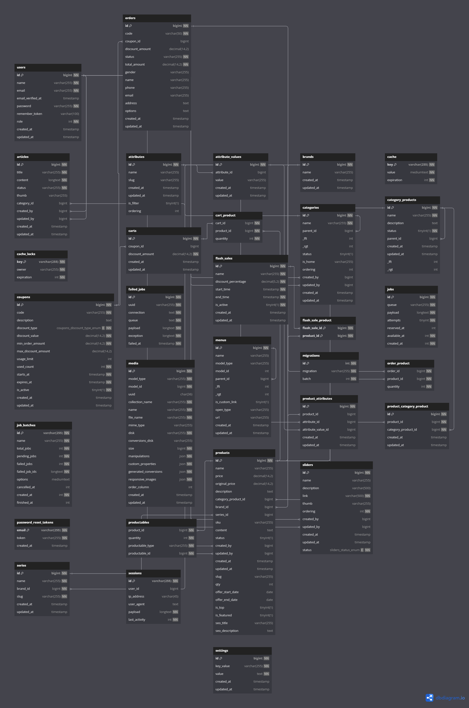

# Laptop Store Platform

## Description

Laptop Store Platform is a web application designed for selling laptops, monitors, and other electronic devices. The platform provides users with the ability to browse products, view detailed product information, and make purchases. It features a comprehensive product management system with support for multiple attributes and the ability to group products by series on the product detail page.

## Features

- **Product Management**: Support for products with multiple attributes, including category, specifications, and more.
- **Advanced Search and Filtering**: Allows users to search and filter products based on various criteria.
- **Product Detail Page**: Displays detailed information about a product and groups products by series.
- **Shopping Cart**: Users can add products to their cart and proceed to checkout.
- **Order Management**: Admins can manage orders, track order status, and handle returns.
- **Promotional Codes and Flash Sales**: Support for applying discount codes and creating limited-time sales offers.

## Technologies Used

- **Backend**: Laravel
- **Frontend**: jQuery, Bootstrap
- **Database**: MySQL

## Database Design
For an overview of the database schema, please refer to the [Database Design Diagram](https://dbdiagram.io/d/core-project-661b837c03593b6b61eea5da).

